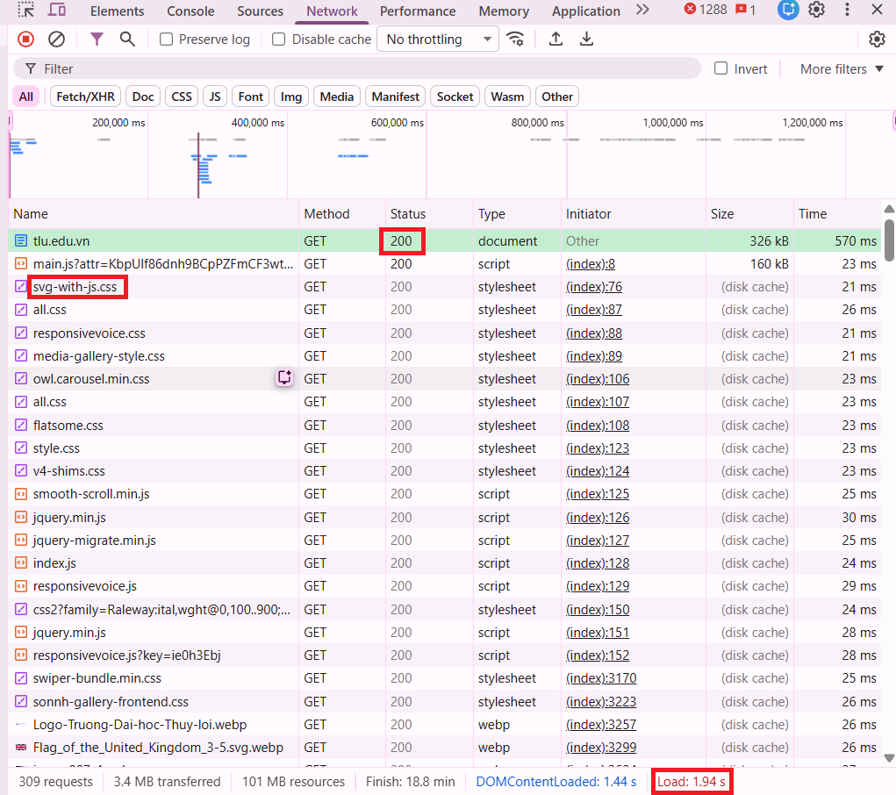
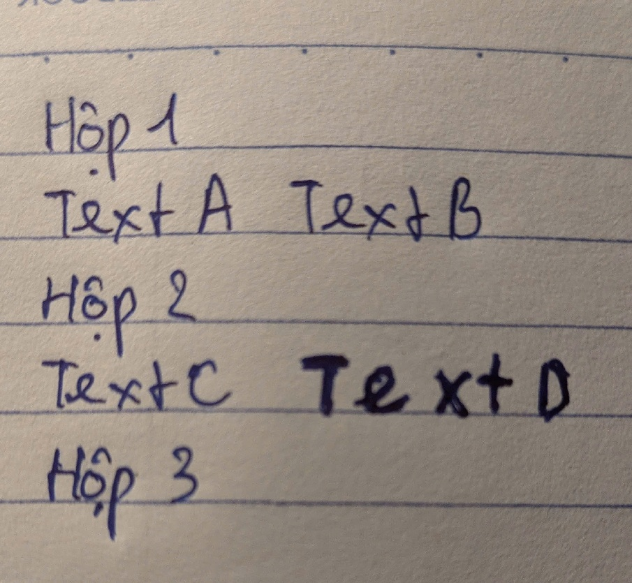

Mỗi câu phải ghi rõ nguồn tham chiếu (tên file + phần nào trong tài liệu).

### Câu A1 (5đ) — HTTP & Browser

Đọc chương 01 (`01_introduction_html_universe.md`), trả lời:

1. Khi bạn gõ `https://shopee.vn` vào trình duyệt và nhấn Enter, hãy liệt kê **đúng thứ tự** ít nhất 5 bước xảy ra (từ DNS lookup đến render).

```
   1. Request xuất phát từ PC thông qua router Wifi ở nhà
   2. Request đi đến nhà cung cấp mạng (Viettel) rồi chạy xuyên cáp quang dưới đáy đại dương
   3. Request sau đó tới hệ thống máy chủ của shopee
   4. Server xử lý: "user này muốn xem gian hàng"
   5. Response chạy ngược lại: cáp quang -> nhà mạng -> router -> PC
   6. Trình duyệt nhận reponse gồm HTML, CSS, JS -> render ra giao diện trang chủ của shopee
   (tham khảo: 01_introduction_html_universe.md + Cuộc Hành Trình 0.3 Giây Xuyên Đại Dương)
```

2. Trong DevTools của Chrome, tab **Network** cho thấy thông tin gì? Hãy mở một trang web bất kỳ, chụp screenshot tab Network và **đánh dấu** (vẽ mũi tên/khoanh tròn) vào:
   - Status Code của request đầu tiên
   - Tổng thời gian load trang
   - Một request trả về file CSS

```
      - Tab Network cho thấy thông tin trình duyệt gửi đi và response từ server
      - Status Code của request đầu tiên: 200
      - Tổng thời gian load trang: 1.97s
      - Một request trả về file CSS: svg-with-js.css
```



### Câu A2 (5đ) — Semantic HTML

Đọc chương 04, trả lời: Tại sao trang web dưới đây bị Google đánh giá SEO thấp? Liệt kê **ít nhất 4 lỗi semantic** và sửa lại.

Sửa lại:

```html
<header>
  <!--Thay div thành header-->
  <div class="logo">ShopTLU</div>
  <nav class="menu">
    <!--Thay div thành nav-->
    <div><a href="/">Trang chủ</a></div>
    <div><a href="/products">Sản phẩm</a></div>
  </nav>
</header>
<main>
  <!--Thay div thành main-->
  <figure class="product">
    <!--Thay div thành figure-->
    <figcaption>
      <!--Gộp chung hai div vào figcaption-->
      <div class="title">iPhone 16 Pro</div>
      <div class="price">25.990.000đ</div>
    </figcaption>
    <div class="image"></div>
  </figure>
</main>
<footer>© 2026 ShopTLU</footer>
<!--Thay div thành footer-->
` (tham khảo: 04_visible_part_html.md )
```

### Câu A3 (5đ) — Block vs Inline

Không chạy code, hãy **vẽ tay** (hoặc mô tả bằng text art) kết quả hiển thị của đoạn HTML sau. Giải thích tại sao.

Kết quả :

Giải thích:

```
- <div> là element loại block do đó nó sẽ chiếm cả dòng.
=> <div> sẽ không đứng chung hàng với những element khác bất kể nó có đứng trước hay sau bất kỳ element nào
- <span>,<strong> là những element loại inline nên chúng chỉ chiếm phần nội dung mà nó chứa.
=> Các elemnt khác nếu cùng là loại inline thì đều có thể đứng cùng dòng với nhau nếu còn khoảng trống, trừ các element loại block
(tham khảo: 04_visible_part_html.md + Block vs Inline — Hai loại element cơ bản)
```

### Câu A4 (5đ) — Table

Đọc chương 05. Giải thích sự khác nhau giữa `<thead>`, `<tbody>`, `<tfoot>`. Tại sao KHÔNG NÊN dùng table để tạo layout trang web? (Ghi rõ ít nhất 3 lý do)

```
- Sự khác biệt chính giữa <thead>, <tbody>, <tfoot> đó là ở vai trò:
      - <thead> là header của bảng, nơi chứa tiêu đề
      - <tbody> là body của bảng, nơi chứa nội dung chính
      - <tfoot> là footer của bảng, nơi kết thúc, tổng kết nội dung của bảng
- Lý do không nên dùng table để tạo layout trang web:
      - Mã code sẽ trở nên dài, cồng kềnh và phức tạp
      - Vi phạm semantic, table chỉ nên dùng để khi cần tới data tabular
      - Ngày nay đã có CSS Grid/Flexbox để làm layout
(tham khảo: 05_tables_hyperlinks.md)
```

---
