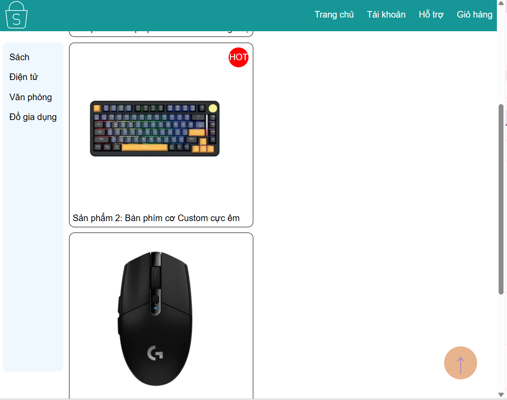

## PHẦN A — KIỂM TRA ĐỌC HIỂU (20 điểm)

### Câu A1 (10đ) — 5 Loại Positioning

| Position   | Vẫn chiếm chỗ trong flow? | Tham chiếu vị trí | Cuộn theo trang? | Use case                                     |
| ---------- | ------------------------- | ----------------- | ---------------- | -------------------------------------------- |
| `static`   | có                        | không             | có               | Mặc định                                     |
| `relative` | có                        | có                | có               | Làm anchor cho absolute con, dịch chuyển nhẹ |
| `absolute` | không                     | có                | không            | Badge, dropdown, tooltip, overlay            |
| `fixed`    | không                     | có                | có               | Chat button, cookie banner, header cố định   |
| `sticky`   | có -> không               | có                | không -> có      | Sticky header, sticky table header, sidebar  |

**Câu hỏi thêm:**  
Khi nào `absolute` tham chiếu `body`: Khi body có thuộc tính `position` khác `static` và các thẻ con cháu của nó nhưng vẫn là tổ tiên của `absolute` không có cái nào có thuộc tính `position` khác `static`.  
Khi nào tham chiếu parent: Khi thẻ cha của absolute có thuộc tính `position` khác `static`.  
Giải thích khái niệm "nearest positioned ancestor": là thẻ tổ tiên gần nhất có `position` khác `static`.

### Câu A2 (10đ) — Flexbox vs Grid

Không chạy code, dự đoán layout cho mỗi trường hợp. **Vẽ sơ đồ bố cục** (text art hoặc vẽ tay chụp ảnh).

```css
/* Trường hợp 1 */
.container {
  display: flex;
}
.item {
  flex: 1;
}
/* 4 items → 
Bố cục = |[ item1 ][ item2 ][ item3 ][ item4 ]|
4 item có cùng chiều rộng do được chia đều  */

/* Trường hợp 2 */
.container {
  display: flex;
  flex-wrap: wrap;
}
.item {
  width: 45%;
  margin: 2.5%;
}
/* 6 items → 
Bố cục = 
|[ item1 ][ item2 ]|
|[ item3 ][ item4 ]|
|[ item5 ][ item6 ]|
 (3 hàng, 2 cột) 
 mỗi item đều chiếm 45%+2*2.5% = 50% chiều rộng của container*/

/* Trường hợp 3 */
.container {
  display: flex;
  justify-content: space-between;
  align-items: center;
}
/* 3 items → 
Bố cục = 
|                                     |    
|[ item1 ]     [ item2 ]     [ item3 ]|
|                                     |    
 */

/* Trường hợp 4 */
.container {
  display: grid;
  grid-template-columns: 200px 1fr 200px;
  gap: 20px;
}
/* 3 items → 
Bố cục = 
|[ 200px ]  (20px)   [ container_width - 200px*2 - 20px*2 ]  (20px)   [ 200px ]|
*/

/* Trường hợp 5 */
.container {
  display: grid;
  grid-template-columns: repeat(3, 1fr);
  gap: 10px;
}
/* 7 items → 
Bố cục =  
|[ item1 ]  (10px)   [ item2 ]  (10px)   [ item3 ]|
|[ item4 ]  (10px)   [ item5 ]  (10px)   [ item6 ]|
|[ item7 ]                                        |
(3 hàng item cuối nằm ở hàng cuối cột đầu tiên?) 
Tất cả item đều có width = container_width/3 
mỗi hàng chỉ có 3 chỗ nhưng có tổng 7 item nên khi hàng có đủ item rồi thì các item còn lại sẽ xuống dòng*/
```

---

## PHẦN B — THỰC HÀNH CODE (60 điểm)

### Bài B1 (15đ) — Positioning Playground

Screenshot:

- Trạng thái header khi scroll (chứng minh header fixed)
- Trạng thái sidebar khi scroll (chứng minh sticky)
- Badge trên card  
  

---

## PHẦN C — SUY LUẬN (20 điểm)

### Câu C1 (10đ) — Flexbox vs Grid: Khi nào dùng gì?

Cho 5 tình huống layout thực tế. Với mỗi tình huống, trả lời: dùng **Flexbox**, **Grid**, hay **kết hợp cả hai**? Giải thích ngắn gọn tại sao.

1. Navigation bar ngang (logo + menu + buttons): flexbox, xử lý một chiều
2. Lưới ảnh Instagram (3 cột đều nhau, số ảnh không biết trước): Grid, vì cần xử lý bố cục theo lưới.
3. Layout blog: main content + sidebar: Grid, kiểm soát kích cỡ hai cột tốt hơn
4. Footer với 4 cột thông tin (Về chúng tôi, Liên kết, Hỗ trợ, Liên hệ): Grid, kiểm soát kích cỡ hai cột tốt hơn
5. Card sản phẩm (ảnh trên, text giữa, nút dưới — nút luôn dính đáy): flexbox, vì chỉ cần xử lý một chiều.

### Câu C2 (10đ) — Debug Flexbox

Layout sau bị lỗi. Mô tả lỗi và sửa.

**Lỗi 1:** Cards không đều chiều cao — nút "Mua" bị nhảy lên/xuống

```css
.card-container {
  display: flex;
  flex-wrap: wrap;
}
.card {
  width: 30%;
  margin: 1.5%;
}
.card img {
  width: 100%;
}
.card h3 {
  font-size: 18px;
}
.card .btn {
  padding: 10px;
}
```

Nguyên nhân:.card không có `display: flex` nên các phần tử bên trong không được kiểm soát, nút không dính đáy, ngoài ra nên thêm `margin-top: auto` cho button để button bị đẩy xuống một khoảng bằng toàn bộ không gian thừa, giúp cho button luôn nằm sát dưới  
Sửa:

```css
.card {
  width: 30%;
  margin: 1.5%;
  display: flex; /*Thêm*/
  flex-direction: column; /*sắp xếp theo chiều dọc*/
}
.card .btn {
  padding: 10px;
  margin-top: auto; /* để btn dính đáy*/
}
```

**Lỗi 2:** Muốn items nằm giữa cả ngang lẫn dọc trong container 100vh, nhưng item vẫn dính góc trái trên

```css
.hero {
  height: 100vh;
  display: flex;
}
.hero-content {
  text-align: center;
}
```

Nguyên nhân: .hero thiếu thuộc tính `justify-content: center` và `align-items: center` để căn .hero-content ở giữa.  
Sửa:

```css
.hero {
  height: 100vh;
  display: flex;
  justify-content: center; /*căn giữa chiều ngang*/
  align-items: center; /*căn giữa chiều dọc*/
}
```

**Lỗi 3:** Sidebar bị co lại khi content quá dài

```css
.layout {
  display: flex;
}
.sidebar {
  width: 250px;
}
.content {
  flex: 1;
}
```

Nguyên nhân: item bên trong .layout mặc định là `flex-shrink: 1`, `.content` có `flex: 1` nên có thêm `flex-grow: 1` nên khi .content to ra thì .sidebar có xu hướng co lại.  
Sửa:

```css
.sidebar {
  width: 250px;
  flex-shrink: 0; /*ngăn cho .sidebar co lại*/
}
```
